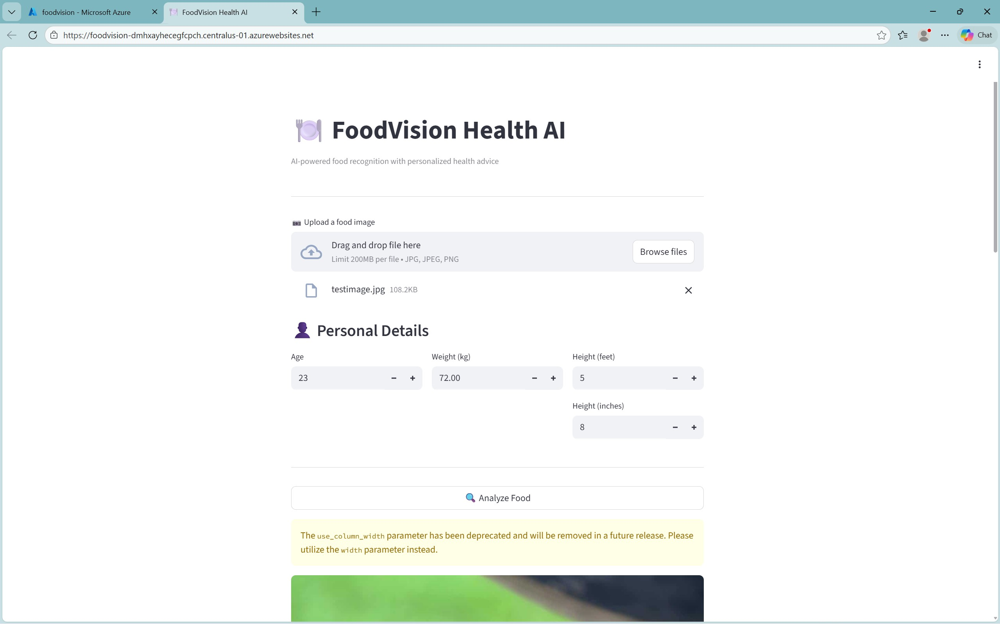
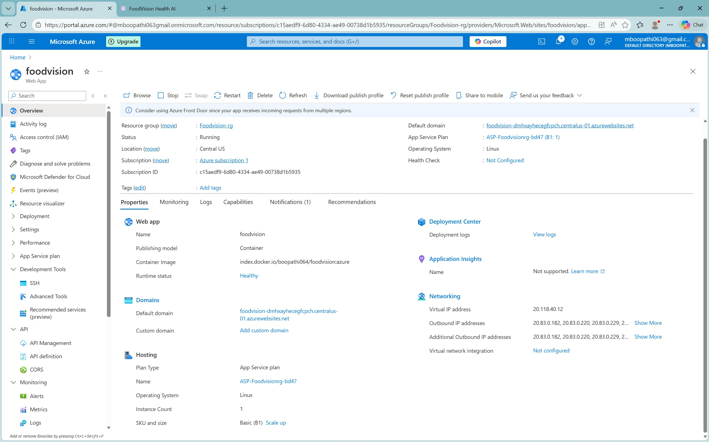
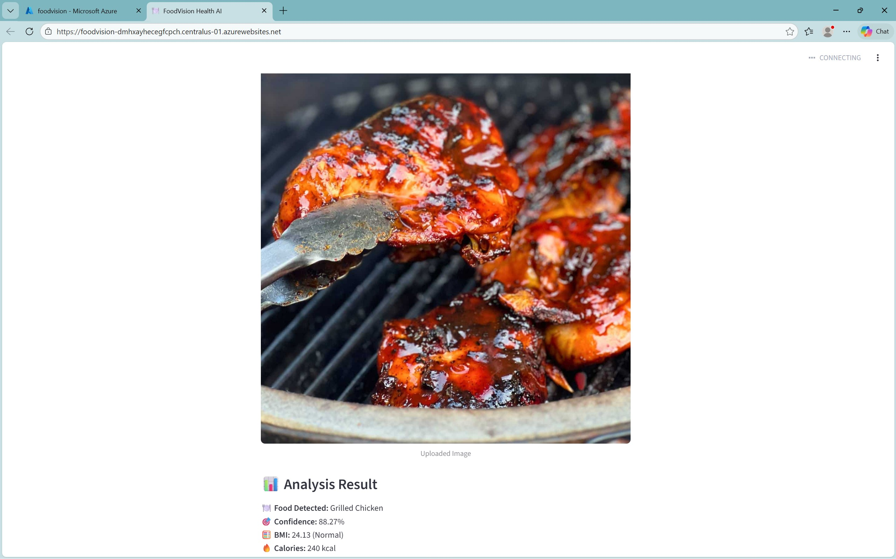

# 🍽️ FoodVision Health AI


A production-ready **Deep Learning + Cloud** application that detects food from images and provides personalized health recommendations based on BMI.

🚀 Deployed using **Docker + Azure App Service**

---

## 🔍 Features

- Deep learning food image classification (ResNet18 – PyTorch)
- Streamlit web interface
- BMI calculation using user height & weight
- Health recommendations based on calorie data
- Dockerized for cloud deployment
- Hosted on Microsoft Azure (Linux container)

---

## 🧠 Tech Stack

| Category | Tools |
|-------|------|
| Deep Learning | PyTorch, TorchVision |
| Model | ResNet18 |
| Frontend | Streamlit |
| Containerization | Docker |
| Cloud | Azure App Service |
| Registry | Docker Hub |

---

## 📸 Application Preview

### Web Interface


### Azure Deployment


### Output


---

## 🧪 How It Works

1. User uploads a food image
2. Model predicts food class
3. User inputs age, weight, height (feet/inches)
4. BMI is calculated
5. Health advice is generated using calorie data

---

## 🐳 Run Locally with Docker

```bash
docker build -t foodvision-app .
docker run -p 8501:8501 foodvision-app
